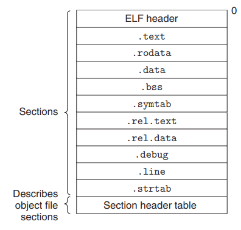
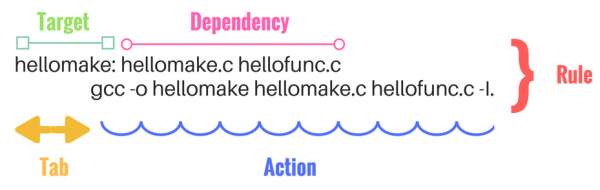
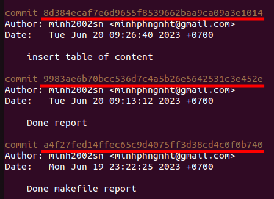
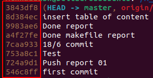
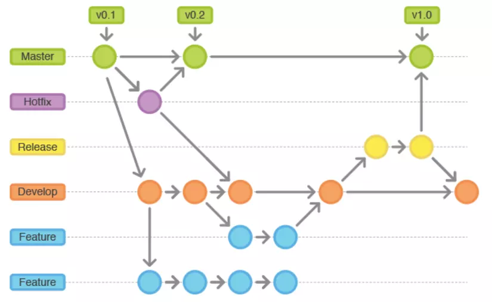
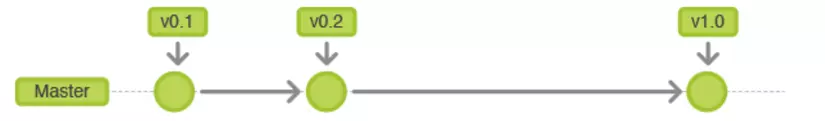
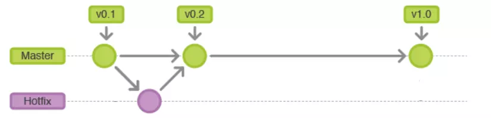
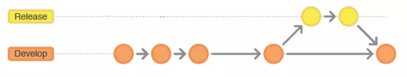
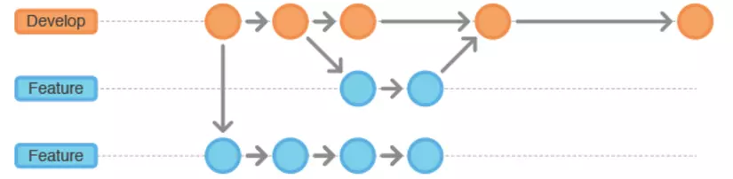

# **Report Basic C Programming**

## **Table of contents**
- [**Report Basic C Programming**](#report-basic-c-programming)
  - [**Table of contents**](#table-of-contents)
  - [**1. Compiling process and Cross-compiler**](#1-compiling-process-and-cross-compiler)
    - [**1.1. Compiling process**](#11-compiling-process)
      - [***1.1.1. Pre-processing step***](#111-pre-processing-step)
      - [***1.1.2. Compiling step***](#112-compiling-step)
      - [***1.1.3. Assembling step***](#113-assembling-step)
      - [***1.1.4. Linking step***](#114-linking-step)
    - [**1.2 Cross compiler**](#12-cross-compiler)
  - [**2. C libraries**](#2-c-libraries)
    - [**2.1. Static linking**](#21-static-linking)
    - [**2.2. Object files**](#22-object-files)
    - [**2.3. Relocatable object files**](#23-relocatable-object-files)
    - [**2.4. Symbols and symbol table**](#24-symbols-and-symbol-table)
    - [**2.5. Symbol resolution**](#25-symbol-resolution)
      - [***2.5.1. Local symbol***](#251-local-symbol)
      - [***2.5.2. Global symbol***](#252-global-symbol)
    - [**2.6. Static libraries**](#26-static-libraries)
    - [**2.7. Dynamic libraries**](#27-dynamic-libraries)
  - [**3. Makefile**](#3-makefile)
    - [**3.1. Rule**](#31-rule)
    - [**3.2. Variables**](#32-variables)
      - [***3.2.1. Definition***](#321-definition)
      - [***3.2.2. Flavors of variables***](#322-flavors-of-variables)
      - [***3.2.3. Some useful automatic variables***](#323-some-useful-automatic-variables)
    - [**3.3. Some useful functions**](#33-some-useful-functions)
  - [**4. Git**](#4-git)
    - [**4.1. Definition**](#41-definition)
    - [**4.2. Basic Git Commands**](#42-basic-git-commands)
    - [**4.3. Git workflow**](#43-git-workflow)


## **1. Compiling process and Cross-compiler**
### **1.1. Compiling process**
The compilation process in C involves 4 steps: pre-processing, compiling, assembling and linking.

#### ***1.1.1. Pre-processing step***

This step includes:
- Removal of comments.
- Expansion of macros.
- Expansion of the included files.
- Conditional compilation.

The pre-processing output is .i files.

**Example 1.1:**

>Header file:
>```C
>#ifndef MAIN_H
>#define MAIN_H
>
>void func_1();
>void func_2();
> 
>#endif
>```
>
>Source file:
>```C
>/* Include main.h file */
>#include "main.h"
>
>/* Macro */
>#define PI          (3.14)
>#define SQUARE(a)   (a)*(a)
>
>/* main function */
>int main()
>{
>    float f = SQUARE(2)*PI;
>}
>```
>
>Typing below command in terminal to generate main.i file:
>```
>gcc -E main.c -o main.i
>```
>
>main.i file's content:
>```C
># 0 "main.c"
># 0 "<built-in>"
># 0 "<command-line>"
># 1 "/usr/include/stdc-predef.h" 1 3 4
># 0 "<command-line>" 2
># 1 "main.c"
>
># 1 "main.h" 1
>
>
>
>void func_1();
>void func_2();
># 3 "main.c" 2
>
>
>
>
>
>
>int main()
>{
>    float f = (2)*(2)*(3.14);
>}
>```

#### ***1.1.2. Compiling step***

This step is to compile .i files to .s file in assembly-level instruction.

**Example 1.2: Using main.c and main.h file in example 1**

>Typing below command to terminal to generate main.s file:
>```
>gcc -S main.c -o main.s
>```
>Content of main.s file:
>```as
>    .file	"main.c"
>    .text
>    .globl	main
>    .type	main, @function
>main:
>.LFB0:
>    .cfi_startproc
>    endbr64
>    pushq	%rbp
>    .cfi_def_cfa_offset 16
>    .cfi_offset 6, -16
>    movq	%rsp, %rbp
>    .cfi_def_cfa_register 6
>    movss	.LC0(%rip), %xmm0
>    movss	%xmm0, -4(%rbp)
>    movl	$0, %eax
>    popq	%rbp
>    .cfi_def_cfa 7, 8
>    ret
>    .cfi_endproc
>.LFE0:
>    .size	main, .-main
>    .section	.rodata
>    .align 4
>.LC0:
>    .long	1095300547
>    .ident	"GCC: (Ubuntu 11.3.0-1ubuntu1~22.04.1) 11.3.0"
>    .section	.note.GNU-stack,"",@progbits
>    .section	.note.gnu.property,"a"
>    .align 8
>    .long	1f - 0f
>    .long	4f - 1f
>    .long	5
>0:
>    .string	"GNU"
>1:
>    .align 8
>    .long	0xc0000002
>    .long	3f - 2f
>2:
>    .long	0x3
>3:
>    .align 8
>4:
>```

#### ***1.1.3. Assembling step***

This step is to compile .s files to .o files in machine-level instruction.

Number of .o files generated is number of .c files.

**Example 1.3: Using main.c and main.h file in example 1**

>Typing below command to terminal to generate main.s file:
>```
>gcc -c main.c -o main.o
>```
>Content of main.o file is in machine level, to understand that, using `readelf -a main.o` command:
>```
>ELF Header:
>  Magic:   7f 45 4c 46 02 01 01 00 00 00 00 00 00 00 00 00 
>  Class:                             ELF64
>  Data:                              2's complement, little endian
>  Version:                           1 (current)
>  OS/ABI:                            UNIX - System V
>  ABI Version:                       0
>  Type:                              REL (Relocatable file)
>  Machine:                           Advanced Micro Devices X86-64
>  Version:                           0x1
>  Entry point address:               0x0
>  Start of program headers:          0 (bytes into file)
>  Start of section headers:          536 (bytes into file)
>  Flags:                             0x0
>  Size of this header:               64 (bytes)
>  Size of program headers:           0 (bytes)
>  Number of program headers:         0
>  Size of section headers:           64 (bytes)
>  Number of section headers:         14
>  Section header string table index: 13
>
>Section Headers:
>  [Nr] Name              Type             Address           Offset
>       Size              EntSize          Flags  Link  Info  Align
>  [ 0]                   NULL             0000000000000000  00000000
>       0000000000000000  0000000000000000           0     0     0
>  [ 1] .text             PROGBITS         0000000000000000  00000040
>       000000000000001c  0000000000000000  AX       0     0     1
>  [ 2] .rela.text        RELA             0000000000000000  00000170
>       0000000000000018  0000000000000018   I      11     1     8
>  [ 3] .data             PROGBITS         0000000000000000  0000005c
>       0000000000000000  0000000000000000  WA       0     0     1
>  [ 4] .bss              NOBITS           0000000000000000  0000005c
>       0000000000000000  0000000000000000  WA       0     0     1
>  [ 5] .rodata           PROGBITS         0000000000000000  0000005c
>       0000000000000004  0000000000000000   A       0     0     4
>  [ 6] .comment          PROGBITS         0000000000000000  00000060
>       000000000000002e  0000000000000001  MS       0     0     1
>  [ 7] .note.GNU-stack   PROGBITS         0000000000000000  0000008e
>       0000000000000000  0000000000000000           0     0     1
>  [ 8] .note.gnu.pr[...] NOTE             0000000000000000  00000090
>       0000000000000020  0000000000000000   A       0     0     8
>  [ 9] .eh_frame         PROGBITS         0000000000000000  000000b0
>       0000000000000038  0000000000000000   A       0     0     8
>  [10] .rela.eh_frame    RELA             0000000000000000  00000188
>       0000000000000018  0000000000000018   I      11     9     8
>  [11] .symtab           SYMTAB           0000000000000000  000000e8
>       0000000000000078  0000000000000018          12     4     8
>  [12] .strtab           STRTAB           0000000000000000  00000160
>       000000000000000d  0000000000000000           0     0     1
>  [13] .shstrtab         STRTAB           0000000000000000  000001a0
>       0000000000000074  0000000000000000           0     0     1
>Key to Flags:
>  W (write), A (alloc), X (execute), M (merge), S (strings), I (info),
>  L (link order), O (extra OS processing required), G (group), T (TLS),
>  C (compressed), x (unknown), o (OS specific), E (exclude),
>  D (mbind), l (large), p (processor specific)
>
>There are no section groups in this file.
>
>There are no program headers in this file.
>
>There is no dynamic section in this file.
>
>Relocation section '.rela.text' at offset 0x170 contains 1 entry:
>  Offset          Info           Type           Sym. Value    Sym. Name + Addend
>00000000000c  000300000002 R_X86_64_PC32     0000000000000000 .rodata - 4
>
>Relocation section '.rela.eh_frame' at offset 0x188 contains 1 entry:
>  Offset          Info           Type           Sym. Value    Sym. Name + Addend
>000000000020  000200000002 R_X86_64_PC32     0000000000000000 .text + 0
>No processor specific unwind information to decode
>
>Symbol table '.symtab' contains 5 entries:
>   Num:    Value          Size Type    Bind   Vis      Ndx Name
>     0: 0000000000000000     0 NOTYPE  LOCAL  DEFAULT  UND 
>     1: 0000000000000000     0 FILE    LOCAL  DEFAULT  ABS main.c
>     2: 0000000000000000     0 SECTION LOCAL  DEFAULT    1 .text
>     3: 0000000000000000     0 SECTION LOCAL  DEFAULT    5 .rodata
>     4: 0000000000000000    28 FUNC    GLOBAL DEFAULT    1 main
>
>No version information found in this file.
>
>Displaying notes found in: .note.gnu.property
>  Owner                Data size 	Description
>  GNU                  0x00000010	NT_GNU_PROPERTY_TYPE_0
>      Properties: x86 feature: IBT, SHSTK
>
>```

#### ***1.1.4. Linking step***

This step is to link all .o files and static library files to generate executable file.

### **1.2 Cross compiler**

A cross compiler is a compiler capable of creating executable code for a platform other than the one on which the compiler is running.

Cross compiler has 5 phases:

- Lexical Analysis.
- Syntactic Analysis.
- Intermediate Code Generating.
- Optimization.
- Code Generation.

## **2. C libraries**

### **2.1. Static linking**

Static linkers such as the Unix ld program take as input a collection of relocatable object files and command-line arguments and generate as output a fully linked executable object file that can be loaded and run.

To build the executable, the linker must perform two main tasks:

- **Symbol resolution:** Object files define and reference symbols. The purpose of symbol resolution is to associate each symbol reference with exactly one symbol definition.
- **Relocation:** Compilers and assemblers generate code and data sections that start at address 0. The linker relocates these sections by associating a memory location with each symbol definition, and then modifying all of the references to those symbols so that they point to this memory location.

### **2.2. Object files**

Object files come in three forms:
- **Relocatable object file:** Contains binary code and data in a form that can be combined with other relocatable object files at compile time to create an executable object file.
- **Executable object file:** Contains binary code and data in a form that can be copied directly into memory and executed.
- **Shared object file:** A special type of relocatable object file that can be loaded into memory and linked dynamically, at either load time or run time.

### **2.3. Relocatable object files**

An object file includes 11 sections and *section header table* 



The *section header table* describes the locations and sizes of the sections.

The *ELF header* includes:
- First 16 bytes that describes the word size and byte ordering (the order of bytes within a word) of system tha generated file.
- ELF header size.
- Object file type (relocatable, executable, shared).
- The machine type.
- The file offset of section header table.
- The size and number of entries in the section header table. 

*.text*: The machine code of compiled program.

*.rodata*: Read-only data (string, format string for *printf*, jump table for switch-case statement...).

*.data*: Initialized global variables.

*.bss*: Uninitialized global variables.

*.symtab*: A symbol table with information about functions and global variables that are defined and referenced in the program.

*.rel.text*: A list of locations in the .text section that will need to be modified when the linker combines this object file with others. In general, any instruction that calls an external function or references a global variable will need to be modified.

*.rel.data*: Relocation information for any global variables that are referenced or defined by the module. In general, any initialized global variable whose initial value is the address of a global variable or externally defined function will need to be modified.

*.debug*: A debugging symbol table with entries for local variables and typedefs defined in the program, global variables defined and referenced in the program, and the original C source file.

*.line*: A mapping between line numbers in the original C source program and machine code instructions in the .text section.

*.strtab*: A string table for the symbol tables in the .symtab and .debug sections, and for the section names in the section headers.

### **2.4. Symbols and symbol table**

The *symbol table* contains an array of entries.

Format of each entry:

```C
typedef struct
{
    int name;
    int value;
    int size;
    char type :4,
        binding :4;
    char reserve;
    char section;
}
```

*name*: A byte of offset into the name of symbol in the string table (*strtab*).

*value*: The symbol's address or the offset from the beginning of the section where object is defined if object file is relocatable object file.

*size*: The size (in byte) of object.

*type*: The 4 bits that describe the symbol is data, function, section or the path name of source file.

*binding*: The 4 bits that describe the symbol is local, global or weak, ...

*reserve*: Done use.

*section*: Describe a section that symbol associate with, can be a section index, ABS if the symbol should not be relocated, UNDEF if the symbol are referenced in this object module but defined in another module, or COMMON if the symbol is an uninitialized data.

### **2.5. Symbol resolution**

#### ***2.5.1. Local symbol***

The compiler ensure that only one definition for each symbol per module and each static local variable has a unique name. Thus, the linker can associate each reference with exactly one symbol definition in symbol table.

#### ***2.5.2. Global symbol***

At compile time, the compiler export each global symbol to assembler as either strong or weak, and the assembler encode this information implicitly in the symbol table of relocation object files.  Unix linkers use the following rules for dealing with multiply defined symbols:

- **Rule 1**: Multiple strong symbols are not allowed.
- **Rule 2**: Given a strong symbol and multiple weak symbols, choose the strong symbol.
- **Rule 3**: Given multiple weak symbols, choose any of the weak symbols

### **2.6. Static libraries**

A static library is  a set of object files that were copied into a single file. It can be linked with other object files in linking process to generate executable file, only the object modules in static library that have referenced by another object files will be linked.

The static library files must be named with prefix 'lib' and suffix '.a'.

To create the static library, use below command:
```
ar -rcs liblib_name.a obj_file_name.o
```
>with:
>- The 'r' flag tells ar to to insert object files or replaces object files in library, with the new object file.
>- The 'c' flag tells ar to create library if it doesn't already exist.
>- The 's' flag tells ar to index the library to speed up symbol look up inside it. 

To link static libraries into executable file, use below command:
```
gcc src_file_name.c -L. -llib_name -o exe_file_name
```
>with:
>- The 'L' flag specifies the path to libraries.
>- The 'l' flag specifies the libraries's name without prefix 'lib' and subfix '.a'.

### **2.7. Dynamic libraries**

A dynamic library is a collection of object files grouped into 1 file. It is not loaded into executable file, it is loaded into memory in running time and can be used by several running programs.

The shared library files must be named with prefix 'lib' and suffix '.so'.

To create the static library, use below command:
```
gcc -c -fPIC src_file_name.c -o obj_file_name.o
gcc -shared obj_file_name.o -o liblib_name.so
```
>with:
>- The 'fPIC' flag stands for 'Position Independent Code' generation, to make the code contained in the .o file is then valid whatever the virtual address occupied at runtime.
>- The 'shared' flag is used to generate shared library.

To link static libraries into executable file, use below command:

    gcc src_file_name.c -L. -llib_name -o exe_file_name

Add the absolute path to .so file to LD_LIBRARY_PATH to make shared library can run.

    export LD_LIBRARY_PATH = absolute_path


## **3. Makefile**
### **3.1. Rule**

A Makefile is a file name Makefile or makefile, that include a set of rules. A rule's structure looks like:



>with:
>- The targets are file names, separated by spaces. Typically, there is only one per rule.
>- The actions are a series of steps typically used to make the target(s). These need to start with a tab character, not spaces.
>- The dependencies are also file names, separated by spaces. These files need to exist before the commands for the target are run. If the dependencies file do not exist, the rules that has same target's name will run.

To run a rule, type in terminal the following command:
```
make target_name
```

**Example 3.1: Rule has dependency is a file**
> Suppose that there is a makefile with content:
>```make
>all: main.o
>   echo Hello makefile!!!
>```
>If there is no main.o file, the result when running `make` is:
>```
>make: *** No rule to make target 'main.o', needed by 'all'.  Stop.
>```
>if the file main.o is already exist, result is:
>```
>echo Hello makefile!!!
>Hello makefile!!!
>```

**Example 3.2: Rule has dependency is a rule's target**
>Suppose that there is a main.c file with content:
>```C
>#include <stdio.h>
>
>int main()
>{
>   printf("Running main.c\n");
>}
>```
>And a makefile with content:
>```make
>all: main.o
>   echo Hello makefile!!!
>
>main.o: main.c
>   echo Generate main.o file
>   gcc -c main.c -o main.o
>```
>if the file main.c is already exist, result is:
>```
>echo Generate main.o file
>Generate main.o file
>gcc -c main.c -o main.o
>echo Hello makefile!!!
>Hello makefile!!!
>```

### **3.2. Variables**
#### ***3.2.1. Definition***
A variable is a name defined in a makefile to represent a string of text, called the variable's value.

To define a value for variables, use `:=` or `=`.

**Example 3.3: Define variable**
>```
>a = one two     # Store the string "one two" to a
>b = 'one two'   # Store the string "one two" to b
>c := "one two"  # Store the string "one two" to c
>```
>- Quotes have no meaning to makefile, it just need when using `printf` function

To refer to a variable, use `$(var_name)` or `${var_name}`.

**Example 3.4: Refer to variable**
>```make
>a = one two     # Store the string "one two" to a
>b = 'one two'   # Store the string "one two" to b
>c := "one two"  # Store the string "one two" to c
>all:
>    echo $(a)
>    echo ${b}
>    echo $(c)
>```
>Result when running `make` is:
>```
>one two    
>one two
>one two
>```

#### ***3.2.2. Flavors of variables***
Flavors of variables is the ways that variables get value.

There are 2 flavors of variables:
- Recursive (use `=`): only looks for the variables when the command is *used*, not when it's *defined*.
- Simply expanded (use `:=`): Like normal imperative programming, only those defined so far get expanded.

**Example 3.5: Flavors of variables**
>```make
>a := one
>b = $(a)
>c := $(a)
>a += two
>all:
>    @echo $(a)
>    @echo $(b)
>    @echo $(c)
>```
>Result when running `make all` is:
>```
>one two    
>one two
>one
>```

#### ***3.2.3. Some useful automatic variables***

`$@`: The target name of the rule.

`$^`: All dependencies of the rule.

`$<`: The first dependency of the rules.

`$?`: All dependencies that are changed and saved after the target.

`$%`: The target member name, when the target is an achieve member.

### **3.3. Some useful functions**

- **"wildcard" function**
    - **Syntax:**
        ```make
        $(wildcard pattern...)
        ```
    - **Function:** To get all object in folder.

    - **Example 3.6: Get all .c files in folder**
        ```make
        SRC = $(wildcard src/*/c)
        ```

- **"subst" function**
    - **Syntax:**
        ```make
        $(subst from, to, text)
        ```

    - **Function:** To replace a substring with another substring.

    - **Example 3.7: Change '.c' into '.o'**
        ```make
        SRC = main.c
        OBJ = $(subst '.c', '.o', $(SRC))
        ```

- **"patsubst" function**
    - **Syntax:**
        ```make
        $(patsubst pattern, replacement, text)
        ```

    - **Function:** Finds whitespace-separated words in text that match pattern and replaces them with replacement. Here pattern may contain a ‘%’ which acts as a wildcard, matching any number of any characters within a word. If replacement also contains a ‘%’, the ‘%’ is replaced by the text that matched the ‘%’ in pattern. Only the first ‘%’ in the pattern and replacement is treated this way; any subsequent ‘%’ is unchanged.

    - **Example 3.8: Change src/XXX.c to obj/XXX.o**
        ```make
        SRC = src/main.c src/func_1.c src/func_2.c
        OBJ = $(patsubst src/%.c, obj/%.o, $(SRC))
        ```

- **"foreach" function**
    - **Syntax:**
        ```make
        $(foreach var, list, text)
        ```

    - **Function:** To converts one list of words (separated by spaces) to another. *var* is set to each word in *list*, and *text* is expanded for each word.

    - **Example 3.9: Change "who are you" into "who! are! you!"**
        ```make
        foo := who are you
        bar := $(foreach wrd,$(foo),$(wrd)!)
        ```

## **4. Git**
### **4.1. Definition**
Git is a free and open source distributed version control system designed to handle everything from small to very large projects with speed and efficiency.

Git has 2 main areas, there are local area and remote area. Local area is a device that you working with your project. Remote area is a server that store your project data.

Local area consist of 3 sections: the working directory, the staging area, repository.


- **Working area**
    
    The working tree is a single checkout of one version of the project. These files are pulled out of the compressed database in the repository and placed on disk for you to use or modify.

- **Staging area**

    The staging area (the cache area or index) contains the working tree directory, including the repository, commits, and branches that would be committed.

- **Local repository**

    Local repository is where Git stores the metadata and object database for your project. This is the most important part of Git, and it is what is copied when you clone a repository from another computer.

- **Remote repository**

    Remote repository is a copy of local repository that is stored in server and can share with other people.

### **4.2. Basic Git Commands**

- **git init**
    - **Function:** Initialization a git project.
    - **Syntax:**
        
        ```make
        git init
        ```

- **git add**
    - **Function:** Add file(s) with changed content from *working direction* to *staging area*
    - **Syntax:**

        Add 1 file
        ```
        git add <file_name>
        ```
        Add any thing
        ```
        git add .
        ```

- **git commit**
    - **Function:** Create a new commit containing the current contents of the staging area and the given log message describing the changes which is *<commit_massage>* given in command.
    - **Syntax:**
        
        ```make
        git commit -m "<commit_message>"
        ```

- **git reset**
    - **Function:** Reset the project to the old commit.
    - **Syntax:**

        Uncommit x last commits but not delete contents.

        ```
        git reset --soft HEAD~x
        ```
        Remove x last commits, including contents.
        ```
        git reset --hard HEAD~x
        ```
        Remove all changes and return the last commit.
        ```
        git reset --hard HEAD
        # or
        git reset --hard
        ```

- **git push**
    - **Function:** Push branch(es) in local repository to remote repository. 
    - **Syntax:**

        Push a branch to remote repository
        ```
        git push <remote_name> <branch_name>
        ```
        Push all branches to remote repository
        ```
        git push <remote_name> --all
        ```

- **git pull**
    - **Function:** Update local repository with remote repository.
    - **Syntax:**
        
        ```make
        git pull
        # or
        git pull <remote> <branch>
        ```

- **git branch**
    - **Function:** To show, create, delete branch(es)
    - **Syntax:**
        
        Show all current branches. Can use -r flag to show all remote branches.
        ```make
        git branch
        ```
        Create a branch
        ```
        git branch <branch_name>
        ```
        Delete branch
        ```
        git branch -D <branch_name>
        ```

- **git checkout**
    - **Function:** Change into another branch.
    - **Syntax:**
        
        Checkout *<branch_name>* branch
        ```
        git checkout <branch_name>
        ```
        Create and checkout *<branch_name>* branch if it is not exist
        ```
        git checkout -b <branch_name>
        ```
    - To checkout from the early commit into a new branch, use below command:
        ```make
        git checkout <commit_hash> -b <branch_name>
        ```
        *<commit_hash>* is the the highlight code in the picture below when using `git log` command.

        

        Or *<commit_hash>* can be the highlight code below when using `git log --oneline` command.

        

- **git merge**
    - **Function:** Merge *<branche_name>* branch into current branch.
    - **Syntax:**
        
        ```make
        git merge <branch_name>
        ```

- **git log**
    - **Function:** Show all commits, can use `--oneline` flag to show in short type.
    - **Syntax:**
        
        ```make
        git log
        ```

- **git status**
    - **Function:** Show which files are different from the last commit.
    - **Syntax:**
        
        ```make
        git status
        ```

- **git stash**
    - **Function:** Save the changed contents or restore contents without using git commit, use when we need to checkout to another branch but do not want to commit in current branch.
    - **Syntax:**
        
        Save the changed contents to the stack when we need to checkout another branch.
        ```make
        git stash
        ```
        Show the saved time list. Can use -p flag to show content.
        ```
        git stash list
        ```
        Restore a saved version. x is a index of save time.
        ```
        git stash apply stash@{x}
        ```
        To clean the stack.
        ```
        git stash drop stash@{x}
        ```
        or use this command to clean up stack.
        ```
        git stash clear
        ```

- **git tag**
    - **Syntax:**

        Create a tag at current commit with a name <tag_name>
        ```make
        git tag <tag_name>
        ```
        Show all tags
        ```
        git tag
        ```
        Delete tag
        ```
        git tag -d <tag_name>
        ```
        Push a tag to remote
        ```
        git push <remote> <tag_name>
        ```
        Delete the tag in remote
        ```
        git push -d <remote> <tag_name>
        ```

### **4.3. Git workflow**
A Git workflow is a recipe or recommendation for how to use Git to accomplish work in a consistent and productive manner.



A git workflow usually consists of 5 kind of branches:

1. Master: Contain release versions for users, each release versions should have a tag.



2. Hotfix: Can be used for hot fixing release versions's errors on the master branch.



3. Release: To store the versions that are checked errors the last time before release.


4. Develop: When developers finish developing a feature of project in release branch, it will be merged into develop branch.



5. Feature: 
    
    There can be a lot of feature branches in the same time, each feature branch is used to develop a feature of project.

    Feature branches's name is always followed by a name of feature.
    
    Eg: feature/button, feature/lcd, feature/mqtt, ...

    When complete developing a feature, its branch is merged into develop branch.


