# **Report Networking**

## **1. What is network?**
A network consists of 2 or more computers that are linked in order to share resource, exchange files, or allow electric communication.

The computers in the network may be linked through cables, telephone lines, radio waves, satellites, or infrared light beams.

There are 2 common types of networks:
- Local Area Network (LAN).
- Wide Area Network (WAN).

### **1.1. LAN (Local Area Network)**

A local area network (LAN) is a collection of devices connected together in one physical location, such as a building, office, or home. 

LAN comprises cables, access points, switches, routers, and other components that enable devices to connect to internal servers, web servers, and other LANs via wide area networks.

### **1.2. WAN (Wide Area Network)**

A wide-area network (WAN) is a collection of local-area networks (LANs) or other networks that communicate with one another.

WAN can connect devices in large geography areas.

### **1.3. OSI model**

The OSI Model (Open Systems Interconnection Model) is a conceptual framework used to describe the functions of a networking system.

The OSI model characterizes computing functions into a universal set of rules and requirements in order to support interoperability between different products and software.

In the OSI reference model, the communications between a computing system are split into seven different abstraction layers: Physical, Data Link, Network, Transport, Session, Presentation, and Application.

**Physical Layer**: 
- It is responsible for the actual physical connection between the devices, information in the form of bits and responsible for transmitting individual bits from one node to the next.
- When receiving data, this layer will get the signal received and convert it into 0s and 1s and send them to the Data Link layer, which will put the frame back together.
- The functions of physical layer:
    - **Bit synchronization**: Provide clock.
    - **Bit rate control**: define number of bits per sent second.
    - **Physical topologies**: Specify how the different devices are arranged in a network (i.e. bus, star, mesh topologies).
    - **Transmit mode**: Define that the transmission mode is simplex, half-duplex or full-duplex.

- Physical layer devices: hub, repeater, modem, cables.

**Data Link Layer:**

- The packet received from the Network layer is further divided into frames depending on the frame size of the NIC(Network Interface Card). DLL also encapsulates Sender and Receiver’s MAC address in the header. 

- The functions of data link layer:
    - **Framing**: Attach special bit patterns to the beginning and end of the set of bits received from network layer when transmitting data.
    - **Physical address**: Add physical address (MAC address) of sender and receiver in header of each frame.
    - **Error control**: Can detect and retransmit damaged or lost frames.
    - **Flow control**: The data rate must be constant on both sides else the data may get corrupted thus, flow control coordinates the amount of data that can be sent before receiving an acknowledgment.
    - **Access control**: When a single communication channel is shared by multiple devices, the MAC sub-layer of the data link layer helps to determine which device has control over the channel at a given time.

- Data Link layer is handled by the NIC (Network Interface Card) and device drivers of host machines. 
- The set of bits in data link layer is called Frame.
- Data link layer devices: switch, bridge, NIC (Network Interface Card).

**Network Layer**:
- Network layer protocol provides logical communication between hosts 
- The Functions of the Network Layer: 
    - **Routing**: Determine which route is suitable from source to destination.
    - **Logical Addressing**: To identify each device on Internetwork uniquely, the network layer defines an addressing scheme. The sender & receiver’s IP addresses are placed in the header by the network layer. Such an address distinguishes each device uniquely and universally.

- The set of bits in network layer is called Packet.
- Network layer devices (or networking devices): router.

**Transport Layer:**
- Transport layer protocol provides the logical communication between processes running on different hosts.
- The Functions of the Transport Layer:
    - **Segmentation and Reassembly**: This layer accepts the message from the (session) layer, and breaks the message into smaller units. Each of the segments produced has a header associated with it. The transport layer at the destination station reassembles the message.
    - **Service Point Addressing**: To deliver the message to the correct process, the transport layer header includes a type of address called service point address or port address. Thus by specifying this address, the transport layer makes sure that the message is delivered to the correct process.
- Services Provided by Transport Layer:
    - Connected-oriented Service.
    - Connectionless Service.
- Transport layer is operated by the Operating System. It is a part of the OS and communicates with the Application Layer by making system calls.
- Set of bits in is called Segment.
- Transport layer device: gateway.

**Session Layer:**
- This layer is responsible for the establishment of connection, maintenance of sessions.

- The Functions of the Session Layer:
    - **Session establishment, maintenance, and termination**: The layer allows the two processes to establish, use and terminate a connection.
    - **Synchronization**: This layer allows a process to add checkpoints that are considered synchronization points in the data. These synchronization points help to identify the error so that the data is re-synchronized properly, and ends of the messages are not cut prematurely and data loss is avoided.
    - **Dialog Controller**: The session layer allows two systems to start communication with each other in half-duplex or full-duplex.

**Presentation Layer:**
- The presentation layer is also called the Translation layer. The data from the application layer is extracted here and manipulated as per the required format to transmit over the network. 

- The Functions of the Presentation Layer: 
    - **Translation**: For example, ASCII to EBCDIC.
    - **Encryption/Decryption**: Encrypt the transmitting data and decrypt the received data.  
    - **Compression**: Reduces the number of bits that need to be transmitted on the network.

**Application Layer:**
- The layer which is implemented by the network applications.
- These applications produce the data, which has to be transferred over the network.
- This layer also serves as a window for the application services to access the network and for displaying the received information to the user. 

### **1.4. TCP/IP model**

- The TCP/IP model was developed prior to the OSI model. It is not exactly similar to the OSI model.
- There are 2 types of TCP/IP model: TCP/IP 4 layers and TCP/IP 5 layers.

**TCP/IP 5 layers model**

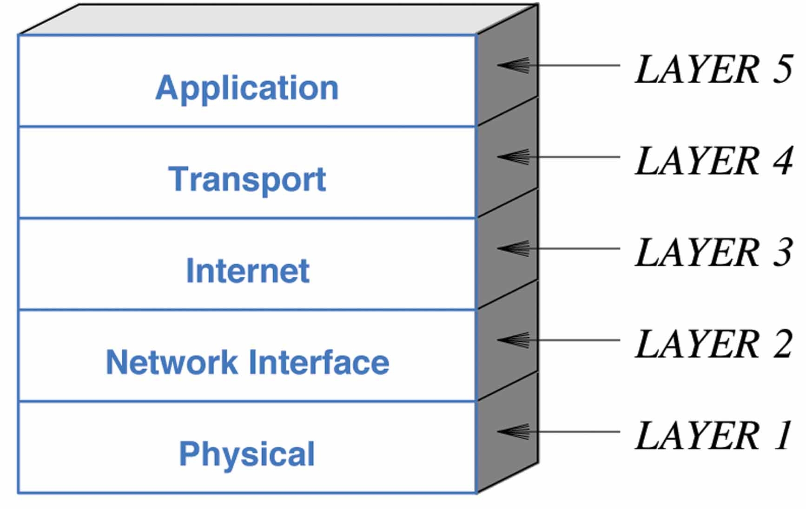

- The TCP/IP 5 layers model incudes the application layer, transport layer, network layer, data link layer and physical layer.
- The first four layers are the same as OSI model.
- The last layer is the combination of 3 last layers of OSI model.

**TCP/IP 4 layers model**

- Same as TCP/IP 5 layers model, but the Network Interface Layer and Physical Layer are combined into 1 layer called Network Access Layer.

## **2. Transport layer**
### **2.1. What is transport layer**
- A transport-layer protocol provides for logical communication between application processes running
on different hosts.
- Transport-layer protocols are implemented in the end systems but not in network routers.
- There are a lots transport layer protocols, e.g. the Internet has 2 protocols: TCP and UDP.

### **2.2. Relationship Between Transport and Network Layers**
- Transport layer protocol provides the logical communication between processes running on different hosts.
- A computer network may make available multiple transport protocols, with each protocol offering a different service model to applications.
- Certain services can be offered by a transport protocol even when the underlying network protocol doesn’t offer the corresponding service at the network layer. E.g. reliable data transfer service, encryption to guarantee.

### **2.3. Transport layer in the Internet**
- The Internet makes two distinct transport-layer protocols available to the application layer:
    - UDP (User Datagram Protocol): Provide unreliable, connectionless service to the invoking application.
    - TCP (Transmission Control Protocol): Provide a reliable, connection-oriented service to the invoking application.
- UDP and TCP extend IP's delivery service (IP stands for Internet network layer protocol) such as extending host-to-host delivery to process-to-process delivery, it is called multiplexing and demultiplexing.
- UDP and TCP provide integrity checking by including error-detection field in thier segment's header.
- Like IP, UDP is an unreliable service, it does not guarantee that data sent by one process will arrive intact to the destination process.
- TCP provides several services:
    - Reliable data transfer by using flow control, sequence numbers, acknowledgements, timers.
    - Congestion control.

### **2.4. Transmission Control Protocol (TCP)**
#### **2.4.1. TCP header format**
- TCP header includes 28 bytes:

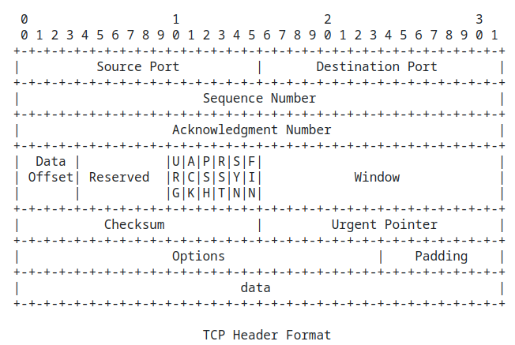

- **Source port (16 bits):** The source port number.
- **Destination port (16 bits):** The destination port number.
- **Sequence number (32 bits):**
    - The sequence number of the first data octet in this segment (except     when SYN is present). If SYN is present the sequence number is the initial sequence number (ISN) and the first data octet is ISN+1.
- **Acknowledge number (32 bits):**
    - If the ACK control bit is set this field contains the value of the next sequence number the sender of the segment is expecting to receive. Once a connection is established this is always sent.
- **Data offset (4 bits):**
    - The number of 32 bit words in the TCP Header.  This indicates where the data begins. The header (even one including options) is an integral number of 32 bits long.
- **Reserve (6 bits):** Reserve for future use, must be zero.
- **Control bit (6 bits):**
    - URG: Urgent pointer field significant.
    - ACK: Acknowledgment field significant.
    - PSH: Push function.
    - RST: Reset the function.
    - SYN: Synchronize sequence number.
    - FIN: No more data from sender.
- **Window (16 bits):**
    - The number of data octets beginning with the one indicated in the acknowledgment field which the sender of this segment is willing to accept.
- **Checksum (16 bits):**
    - Checksum the 1s complement of the sum of all the 16-bit words in the TCP segment and 12 bytes pseudo header, which are carried in the Internet Protocol.
    - At the receiver, all TCP segment and 12 bytes pseudo IP header are added, including checksum. If no errors are introduced into the packet, result will be 1111 1111 1111 1111.
- **Urgent pointer (16 bits):**
    - This field communicates the current value of the urgent pointer as a positive offset from the sequence number in this segment. The urgent pointer points to the sequence number of the octet following the urgent data. This field is only be interpreted in segments with the URG control bit set.
- **Options:**
    - Options may occupy space at the end of the TCP header and are a multiple of 8 bits in length.  All options are included in the checksum.  An option may begin on any octet boundary. There are two cases for the format of an option:
        - Case 1: A single octet of option-kind.
        - Case 2: An octet of option-kind, an octet of option-length, and the actual option-data octets.
    - The option-length counts the two octets of option-kind and option-length as well as the option-data octets.
    - Note that the list of options may be shorter than the data offset field might imply. The content of the header beyond the End-of-Option option must be header padding (i.e., zero).
    - A TCP must implement all options.
    - Currently defined options include (kind indicated in octal):

    | Kind | Length | Meaning               |
    |:----:|:------:|:---------------------:|
    |  0   |   -    |End of option list     |
    |  1   |   -    |No-Operation           |
    |  2   |   4    |Maximum Segment Size   |

    - Specific Option Definitions

        - End of Option List (0000 0000 - Kind = 0):
            This option code indicates the end of the option list. This might not coincide with the end of the TCP header according to the Data Offset field.  This is used at the end of all options, not the end of each option, and need only be used if the end of the options would not otherwise coincide with the end of the TCP
            header.

        - No-Operation (0000 0001 - Kind = 1)"
            This option code may be used between options, for example, to align the beginning of a subsequent option on a word boundary.
            There is no guarantee that senders will use this option, so receivers must be prepared to process options even if they do not begin on a word boundary.

        - Maximum Segment Size: (0x0204XXXX - Kind  = 2, Length = 4)

            - Maximum Segment Size Option Data: 16 bits.
                - If this option is present, then it communicates the maximum receive segment size at the TCP which sends this segment.
                - This field must only be sent in the initial connection request (i.e., in segments with the SYN control bit set). If this option is not used, any segment size is allowed.
- **Padding:**
    - The TCP header padding is used to ensure that the TCP header ends and data begins on a 32 bit boundary. The padding is composed of zeros.

#### **2.4.2. 3-way Handshake**
*authentication* must be done solely on the basis of messages and data exchanged as part of an authentication protocol. As in the case of our development of a reliable data transfer (rdt) protocol we will find it instructive here to develop various versions of an authentication protocol, which we will call ap (authentication protocol), and poke holes in each version.

**Authentication Protocol Version 1.0 (ap1.0)**

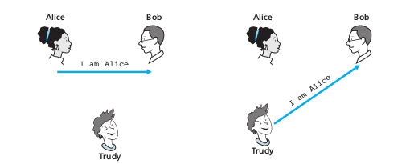

Perhaps the simplest authentication protocol we can imagine is one where Alice simply sends a message to Bob saying she is Alice.

**Authentication Protocol Version 2.0 (ap2.0)**

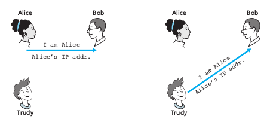

If Alice has a well-known network address (e.g., an IP address) from which she always communicates, Bob could attempt to authenticate Alice by verifying that the source address on the IP datagram carrying the authentication message matches Alice’s well-known address. In this case, Alice would be authenticated. This might stop a very network-naive intruder from impersonating Alice.

**TCP Connection Management - 3-way handshake**

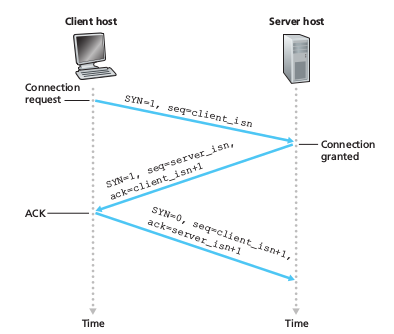

In this subsection we take a closer look at how a TCP connection is established and torn down. Although this topic may not seem particularly thrilling, it is important because TCP connection establishment can significantly add to perceived delays (for example, when surfing the Web). Furthermore, many of the most common network attacks—including the incredibly popular SYN flood attack—exploit vulnerabilities in TCP connection management. Let’s first take a look at how a TCP connection is established. Suppose a process running in one host (client) wants to initiate a connection with another process in another host (server). The client application process first informs the client TCP that it wants to establish a connection to a process in the server. The TCP in the client then proceeds to establish a TCP connection with the TCP in the server in the following manner:

- **Step 1**: The client-side TCP first sends a special TCP segment to the server-side TCP. This special segment contains no application-layer data. But one of the flag bits in the segment’s header, the SYN bit, is set to 1. For this reason, this special segment is referred to as a SYN segment. In addition, the client randomly chooses an initial sequence number (client_isn) and puts this number in the sequence number field of the initial TCP SYN segment.

- **Step 2**: the server extracts the TCP SYN segment from the datagram, allocates the TCP buffers and variables to the connection, and sends a connection-granted segment to the client TCP. This connection-granted segment also contains no application-layer data. However, it does contain three important pieces of information in the segment header. First, the SYN bit is set to 1. Second, the acknowledgment field of the TCP segment header is set to client_isn+1. Finally, the server chooses its own initial sequence number (server_isn) and puts this value in the sequence number field of the TCP segment header. This connection-granted segment is saying, in effect, “I received your SYN packet to start a connection with your initial sequence number, client_isn. I agree to establish this connection. My own initial sequence number is server_isn.” The connection-granted segment is referred to as a ***SYNACK segment***.

- **Step 3**: Upon receiving the SYNACK segment, the client also allocates buffers and variables to the connection. The client host then sends the server yet another segment; this last segment acknowledges the server’s connection-granted segment (the client does so by putting the value server_isn+1 in the acknowledgment field of the TCP segment header). The SYN bit is set to zero, since the connection is established. This third stage of the three-way handshake may carry client-to-server data in the segment payload.

#### **2.4.3. Estimating the Round-Trip time (RTT)**

The sample RTT, denoted *SampleRTT*, for a segment is the amount of time between when the segment is sent (that is, passed to IP) and when an acknowledgment for the segment is received. Instead of measuring a *SampleRTT* for every transmitted
segment, most TCP implementations take only one *SampleRTT* measurement at a time. That is, at any point in time, the *SampleRTT* is being estimated for only one of the transmitted but currently unacknowledged segments, leading to a new value of *SampleRTT* approximately once every RTT. Also, TCP never computes a *SampleRTT* for a segment that has been retransmitted; it only measures *SampleRTT* for segments that have been transmitted once.

In order to estimate a typical RTT, it is therefore natural to take some sort of average of the *SampleRTT* values. TCP maintains an average, called EstimatedRTT, of the *SampleRTT* values. Upon obtaining a new SampleRTT, TCP updates EstimatedRTT according to the following formula.

> EstimatedRTT = (1 – α) * EstimatedRTT + α * SampleRTT

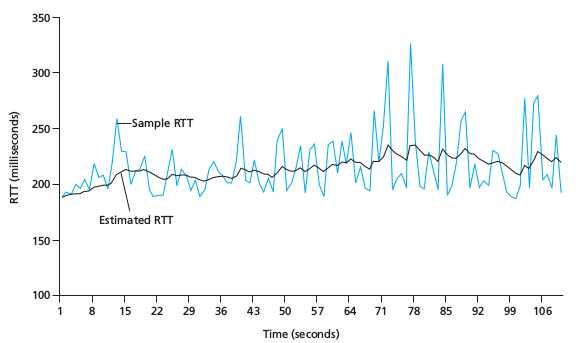

#### **2.4.4. Guaranteed data transmission**
**Go Back N**

In a Go-Back-N (GBN) protocol, the sender is allowed to transmit multiple packets (when available) without waiting for an acknowledgment, but is constrained to have no more than some maximum allowable number, N, of unacknowledged packets in the pipeline.

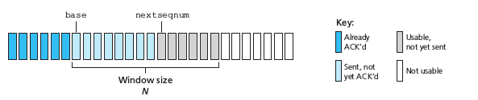

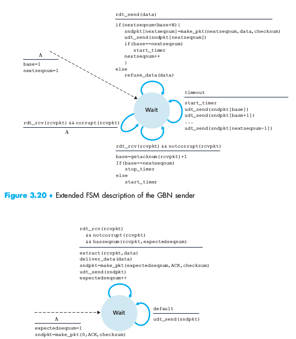

**Selective Repeat**

The GBN protocol allows the sender to potentially “fill the pipeline” with packets, thus avoiding the channel utilization problems we noted with stop-and-wait protocols. There are, however, scenarios in which GBN itself suffers from performance problems. In particular, when the window size and bandwidth-delay product are both large, many packets can be in the pipeline. A single packet error can thus cause GBN to retransmit a large number of packets, many unnecessarily.

As the probability of channel errors increases, the pipeline can become filled with these unnecessary retransmissions. Imagine, in our message-dictation scenario, that if every time a word was garbled, the surrounding 1,000 words (for example, a window size of 1,000 words) had to be repeated. The dictation would be slowed by all of the reiterated words.

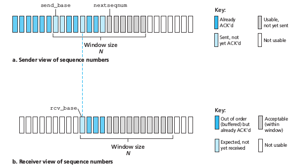

- **Sender events and actions:**

  1. *Data received from above*: When data is received from above, the SR sender checks the next available sequence number for the packet. If the sequence number is within the sender’s window, the data is packetized and sent; otherwise it is either buffered or returned to the upper layer for later transmission, as in GBN.

  2. *Timeout*: Timers are again used to protect against lost packets. However, each packet must now have its own logical timer, since only a single packet will be transmitted on timeout. A single hardware timer can be used to mimic the operation of multiple logical timers [Varghese 1997].

  3. *ACK received*: If an ACK is received, the SR sender marks that packet as having been received, provided it is in the window. If the packet’s sequence number is equal to send_base, the window base is moved forward to the
  unacknowledged packet with the smallest sequence number. If the window moves and there are untransmitted packets with sequence numbers that now fall within the window, these packets are transmitted.

- **Receiver events and actions:**

  1. Packet with sequence number in [rcv_base, rcv_base+N-1]is cor  rectly received. In this case, the received packet falls within the receiver’s win  dow and a selective ACK packet is returned to the sender. If the packet was not previously received, it is buffered. If this packet has a sequence number equal to the base of the receive window (rcv_base in Figure 3.22), then this packet, and any previously buffered and consecutively numbered (beginning with rcv_base) packets are delivered to the upper layer. The receive window is   then moved forward by the number of packets delivered to the upper layer. As an example, consider Figure 3.26. When a packet with a sequence number of rcv_base=2 is received, it and packets 3, 4, and 5 can be delivered to the upper layer.

  2. Packet with sequence number in [rcv_base-N, rcv_base-1] is correctly received. In this case, an ACK must be generated, even though this is a packet that the receiver has previously acknowledged.

  3. Otherwise. Ignore the packet.

#### **2.4.5. Flow Control**

TCP provides a flow-control service to its applications to eliminate the possibility of the sender overflowing the receiver’s buffer. Flow control is thus a speed matching service—matching the rate at which the sender is sending against the rate at which the receiving application is reading.

TCP provides flow control by having the sender maintain a variable called the receive window. Informally, the receive window is used to give the sender an idea of how much free buffer space is available at the receiver. Because TCP is full-duplex, the sender at each side of the connection maintains a distinct receive window. Let’s investigate the receive window in the context of a file transfer. Suppose that Host A is sending a large file to Host B over a TCP connection. Host B allocates a receive buffer to this connection; denote its size by RcvBuffer. From time to time, the application process in Host B reads from the buffer. Define the following variables:

- *LastByteRead*: the number of the last byte in the data stream read from the buffer by the application process in B

- *LastByteRcvd*: the number of the last byte in the data stream that has arrived from the network and has been placed in the receive buffer at B

Because TCP is not permitted to overflow the allocated buffer, we must have:
> LastByteRcvd – LastByteRead =< RcvBuffer

The receive window, denoted rwnd is set to the amount of spare room in the buffer:
> rwnd = RcvBuffer – [LastByteRcvd – LastByteRead]

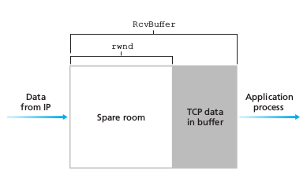

#### **2.4.6. TCP Congestion Control**
TCP congestion control is a method used by the TCP protocol to manage data flow over a  etwork and prevent congestion. TCP uses a congestion window and congestion policy that avoids congestion. Previously, we assumed that only the receiver could dictate the ender’s window size. We ignored another entity here, the network. If the network cannot deliver the data as fast as it is created by the sender, it must tell the sender to slow down. In other words, in addition to the receiver, the network is a second entity that determines the size of the sender’s window 

**Congestion Policy in TCP:**
  1. *Slow Start Phase*: Starts slow increment is exponential to the threshold.
  2. *Congestion Avoidance Phase*: After reaching the threshold increment is by 1.
  3. *Congestion Detection Phase*: The sender goes back to the Slow start phase or the congestion avoidance phase

- **Slow Start Phase**

    Exponential increment: In this phase after every RTT the congestion window size increments exponentially. 

    *Example*: If the initial congestion window size is 1 segment, and the first segment is successfully acknowledged, the congestion window size becomes 2 segments. If the next transmission is also acknowledged, the congestion window size doubles to 4 segments. This exponential growth continues as long as all segments are successfully acknowledged.

    > Initially cwnd = 1
    >
    > After 1 RTT, cwnd = 2^(1) = 2
    >
    > 2 RTT, cwnd = 2^(2) = 4
    >
    > 3 RTT, cwnd = 2^(3) = 8

- **Congestion Avoidance Phase**

    Additive increment: This phase starts after the threshold value also denoted as ssthresh. The size of cwnd(congestion window) increases additive. After each RTT cwnd = cwnd + 1.

    Example:- if the congestion window size is 20 segments and all 20 segments are successfully acknowledged within an RTT, the congestion window size would be increased to 21 segments in the next RTT. If all 21 segments are again successfully acknowledged, the congestion window size would be increased to 22 segments, and so on.

    >Initially cwnd = i
    >
    >After 1 RTT, cwnd = i+1
    >
    >2 RTT, cwnd = i+2
    >
    >3 RTT, cwnd = i+3

- **Congestion Detection Phase**

    Multiplicative decrement: If congestion occurs, the congestion window size is decreased. The only way a sender can guess that congestion has happened is the need to retransmit a segment. Retransmission is needed to recover a missing packet that is assumed to have been dropped by a router due to congestion. Retransmission can occur in one of two cases: when the RTO timer times out or when three duplicate ACKs are received.

    **Case 1**: Retransmission due to Timeout – In this case, the congestion possibility is high.

    > (a) ssthresh is reduced to half of the current window size.
    >
    > (b) set cwnd = 1
    >
    > (c) start with the slow start phase again.

    **Case 2**: Retransmission due to 3 Acknowledgement Duplicates – The congestion possibility is less.

    > (a) ssthresh value reduces to half of the current window size.
    >
    > (b) set cwnd = ssthresh
    >
    > (c) start with congestion avoidance phase

### **2.5. User Datagram Protocol (UDP)**
User Datagram Protocol (UDP) is a Transport Layer protocol. UDP is a part of the Internet Protocol suite, referred to as UDP/IP suite. Unlike TCP, it is an unreliable and connectionless protocol. So, there is no need to establish a connection prior to data transfer. The UDP helps to establish low-latency and loss-tolerating connections establish over the network.The UDP enables process to process communication.

#### **2.5.1. UDP header format**

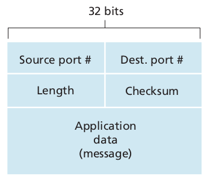

- **Source port (16 bits):** The source port number.
- **Destination port (16 bits):** The destination port number.
- **Length (16 bits):** The length of segment including the UDP header and the data.
- **Checksum (16 bits):**
    - Checksum the 1s complement of the sum of all the 16-bit words in the TCP segment and 12 bytes pseudo header, which are carried in the Internet Protocol.
    - At the receiver, all TCP segment and 12 bytes pseudo IP header are added, including checksum. If no errors are introduced into the packet, result will be 1111 1111 1111 1111.