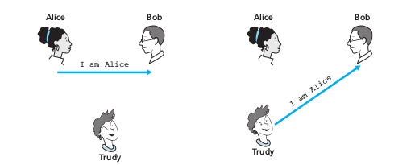
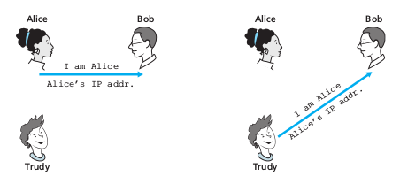
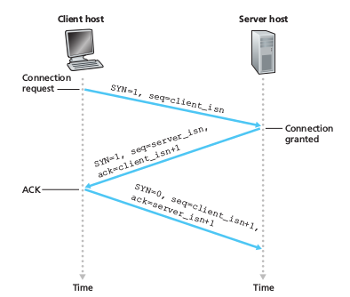
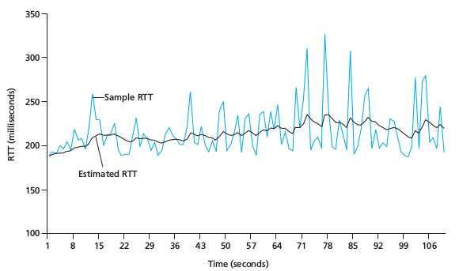
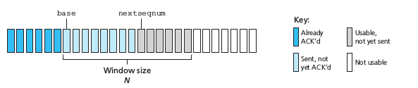
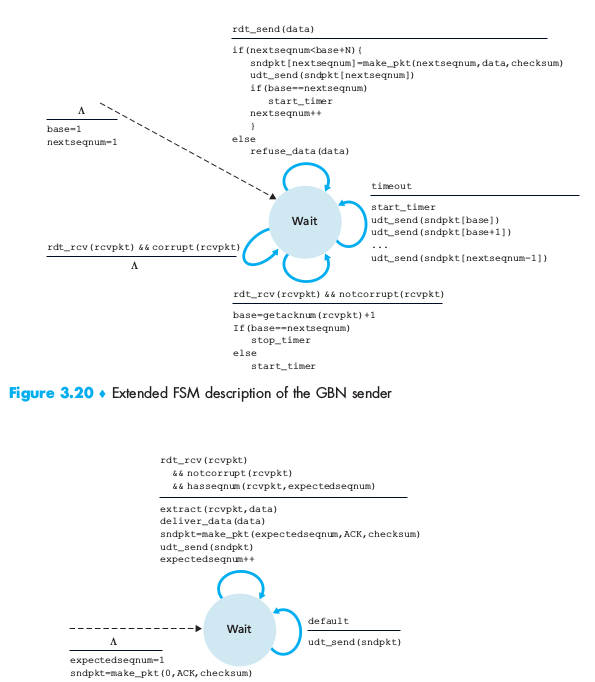
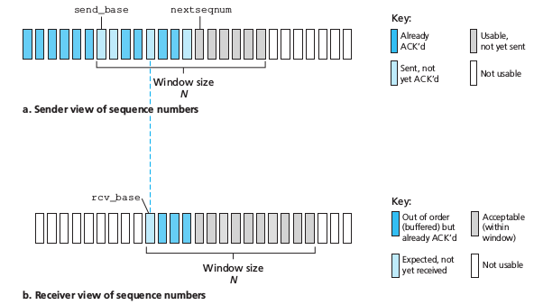
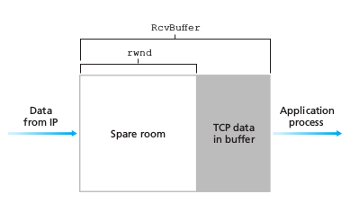

## 3-way Handshake
*authentication* must be done solely on the basis of messages and data exchanged as part of an authentication protocol. As in the case of our development of a reliable data transfer (rdt) protocol we will find it instructive here to develop various versions of an authentication protocol, which we will call ap (authentication protocol), and poke holes in each version.

### Authentication Protocol ap1.0

Perhaps the simplest authentication protocol we can imagine is one where Alice simply sends a message to Bob saying she is Alice.

### Authentication Protocol ap2.0

If Alice has a well-known network address (e.g., an IP address) from which she
always communicates, Bob could attempt to authenticate Alice by verifying that the source address on the IP datagram carrying the authentication message matches Alice’s well-known address. In this case, Alice would be authenticated. This might
stop a very network-naive intruder from impersonating Alice,

### TCP Connection Management - 3-way handshake

In this subsection we take a closer look at how a TCP connection is established and torn down. Although this topic may not seem particularly thrilling, it is important because TCP connection establishment can significantly add to perceived delays (for example, when surfing the Web). Furthermore, many of the most common network attacks—including the incredibly popular SYN flood attack—exploit vulnerabilities in TCP connection management. Let’s first take a look at how a TCP connection is established. Suppose a process running in one host (client) wants to initiate a connection with another process in another host (server). The client application process first informs the client TCP that it wants to establish a connection to a process in the server. The TCP in the client then proceeds to establish a TCP connection with the TCP in the server in the following manner:
- **Step 1**: The client-side TCP first sends a special TCP segment to the server-side TCP. This special segment contains no application-layer data. But one of the flag bits in the segment’s header, the SYN bit, is set to 1. For this reason, this special segment is referred to as a SYN segment. In addition, the client randomly chooses an initial sequence number (client_isn) and puts this number in the sequence number field of the initial TCP SYN segment.

- **Step 2**: the server extracts the TCP SYN segment from the datagram, allocates the TCP buffers and variables to the connection,
and sends a connection-granted segment to the client TCP. This connection-granted segment also contains no application-layer data. However, it does contain three important pieces of information in the segment header. First, the SYN bit is set to 1. Second, the acknowledgment field of the TCP segment header is set to client_isn+1.
Finally, the server chooses its own initial sequence number (server_isn) and puts this value in the sequence number field of the TCP segment header. This connection-granted segment is saying, in effect, “I received your SYN packet to start a connection with your initial sequence number, client_isn. I agree to establish this connection. My own initial sequence number is server_isn.” The connection-granted segment is referred to as a ***SYNACK segment***.

- **Step 3**: Upon receiving the SYNACK segment, the client also allocates buffers and variables to the connection. The client host then sends the server yet another segment; this last segment acknowledges the server’s connection-granted segment (the client does so by putting the value server_isn+1 in the acknowledgment field of the TCP segment header). The SYN bit is set to zero, since the connection is established. This third stage of the three-way handshake may carry client-to-server data in the segment payload.

## Round-Trip time estimation and Timeout

### Estimating the Round-Trip time (RTT)
The sample RTT, denoted *SampleRTT*, for a segment is the amount of time between when the segment is sent (that is, passed to IP) and when an acknowledgment for the segment is received. Instead of measuring a *SampleRTT* for every transmitted
segment, most TCP implementations take only one *SampleRTT* measurement at a time. That is, at any point in time, the *SampleRTT* is being estimated for only one of the transmitted but currently unacknowledged segments, leading to a new value of *SampleRTT* approximately once every RTT. Also, TCP never computes a *SampleRTT* for a segment that has been retransmitted; it only measures *SampleRTT* for segments that have been transmitted once.

In order to estimate a typical RTT, it is therefore natural to take some sort of average of the *SampleRTT* values. TCP maintains an average, called EstimatedRTT, of the *SampleRTT* values. Upon obtaining a new SampleRTT, TCP updates EstimatedRTT according to the following formula.

> EstimatedRTT = (1 – α) * EstimatedRTT + α * SampleRTT

## Go Back N

In a Go-Back-N (GBN) protocol, the sender is allowed to transmit multiple packets (when available) without waiting for an acknowledgment, but is constrained to have no more than some maximum allowable number, N, of unacknowledged packets in the pipeline.

## Selective Repeat 
The GBN protocol allows the sender to potentially “fill the pipeline” with packets, thus avoiding the channel utilization problems we noted with stop-and-wait protocols. There are, however, scenarios in which GBN itself suffers from performance problems. In particular, when the window size and bandwidth-delay product are both large, many packets can be in the pipeline. A single packet error can thus cause GBN to retransmit a large number of packets, many unnecessarily. 
As the probability of channel errors increases, the pipeline can become filled with these unnecessary retransmissions. Imagine, in our message-dictation scenario, that if every time a word was garbled, the surrounding 1,000 words (for example, a window size of 1,000 words) had to be repeated. The dictation would be slowed by all of the reiterated words.

### Sender events and actions:
1. *Data received from above*: When data is received from above, the SR sender
checks the next available sequence number for the packet. If the sequence
number is within the sender’s window, the data is packetized and sent; other-
wise it is either buffered or returned to the upper layer for later transmission,
as in GBN.
2. *Timeout*: Timers are again used to protect against lost packets. However, each
packet must now have its own logical timer, since only a single packet will
be transmitted on timeout. A single hardware timer can be used to mimic the
operation of multiple logical timers [Varghese 1997].
3. *ACK received*: If an ACK is received, the SR sender marks that packet as
having been received, provided it is in the window. If the packet’s sequence
number is equal to send_base, the window base is moved forward to the
unacknowledged packet with the smallest sequence number. If the window
moves and there are untransmitted packets with sequence numbers that now
fall within the window, these packets are transmitted.
### Receiver events and actions:

1. Packet with sequence number in [rcv_base, rcv_base+N-1]is cor-
rectly received. In this case, the received packet falls within the receiver’s win-
dow and a selective ACK packet is returned to the sender. If the packet was not
previously received, it is buffered. If this packet has a sequence number equal to
the base of the receive window (rcv_base in Figure 3.22), then this packet,
and any previously buffered and consecutively numbered (beginning with
rcv_base) packets are delivered to the upper layer. The receive window is
then moved forward by the number of packets delivered to the upper layer. As
an example, consider Figure 3.26. When a packet with a sequence number of
rcv_base=2 is received, it and packets 3, 4, and 5 can be delivered to the
upper layer.
2. Packet with sequence number in [rcv_base-N, rcv_base-1]is cor-
rectly received. In this case, an ACK must be generated, even though this is a
packet that the receiver has previously acknowledged.
3. Otherwise. Ignore the packet.

## Flow Control

TCP provides a flow-control service to its applications to eliminate the possibility of the sender overflowing the receiver’s buffer. Flow control is thus a speed matching service—matching the rate at which the sender is sending against the rate at which the receiving application is reading.
TCP provides flow control by having the sender maintain a variable called the receive window. Informally, the receive window is used to give the sender an idea of how much free buffer space is available at the receiver. Because TCP is full-duplex, the sender at each side of the connection maintains a distinct receive window. Let’s investigate the receive window in the context of a file transfer. Suppose that Host A is sending a large file to Host B over a TCP connection. Host B allocates a receive buffer to this connection; denote its size by RcvBuffer. From time to time, the application process in Host B reads from the buffer. Define the following variables:
- *LastByteRead*: the number of the last byte in the data stream read from the buffer by the application process in B
- *LastByteRcvd*: the number of the last byte in the data stream that has arrived from the network and has been placed in the receive buffer at B

Because TCP is not permitted to overflow the allocated buffer, we must have:
> LastByteRcvd – LastByteRead =< RcvBuffer

The receive window, denoted rwnd is set to the amount of spare room in the buffer:
> rwnd = RcvBuffer – [LastByteRcvd – LastByteRead]

## TCP Congestion Control
TCP congestion control is a method used by the TCP protocol to manage data flow over a  etwork and prevent congestion. TCP uses a congestion window and congestion policy that avoids congestion. Previously, we assumed that only the receiver could dictate the ender’s window size. We ignored another entity here, the network. If the network cannot deliver the data as fast as it is created by the sender, it must tell the sender to slow down. In other words, in addition to the receiver, the network is a second entity that determines the size of the sender’s window 

### Congestion Policy in TCP
1. Slow Start Phase: Starts slow increment is exponential to the threshold.
2. Congestion Avoidance Phase: After reaching the threshold increment is by 1.
3. Congestion Detection Phase: The sender goes back to the Slow start phase or the congestion avoidance phase

**Slow Start Phase**

Exponential increment: In this phase after every RTT the congestion window size increments exponentially. 

Example:- If the initial congestion window size is 1 segment, and the first segment is successfully acknowledged, the congestion window size becomes 2 segments. If the next transmission is also acknowledged, the congestion window size doubles to 4 segments. This exponential growth continues as long as all segments are successfully acknowledged.

>Initially cwnd = 1
>After 1 RTT, cwnd = 2^(1) = 2
>2 RTT, cwnd = 2^(2) = 4
>3 RTT, cwnd = 2^(3) = 8

**Congestion Avoidance Phase**

Additive increment: This phase starts after the threshold value also denoted as ssthresh. The size of cwnd(congestion window) increases additive. After each RTT cwnd = cwnd + 1.

Example:- if the congestion window size is 20 segments and all 20 segments are successfully acknowledged within an RTT, the congestion window size would be increased to 21 segments in the next RTT. If all 21 segments are again successfully acknowledged, the congestion window size would be increased to 22 segments, and so on.

>Initially cwnd = i
>After 1 RTT, cwnd = i+1
>2 RTT, cwnd = i+2
>3 RTT, cwnd = i+3

**Congestion Detection Phase**

Multiplicative decrement: If congestion occurs, the congestion window size is decreased. The only way a sender can guess that congestion has happened is the need to retransmit a segment. Retransmission is needed to recover a missing packet that is assumed to have been dropped by a router due to congestion. Retransmission can occur in one of two cases: when the RTO timer times out or when three duplicate ACKs are received.

Case 1: Retransmission due to Timeout – In this case, the congestion possibility is high.

>(a) ssthresh is reduced to half of the current window size.
(b) set cwnd = 1
(c) start with the slow start phase again.

Case 2: Retransmission due to 3 Acknowledgement Duplicates – The congestion possibility is less.

>(a) ssthresh value reduces to half of the current window size.
(b) set cwnd= ssthresh
(c) start with congestion avoidance phase

