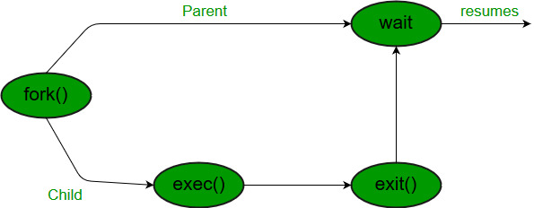
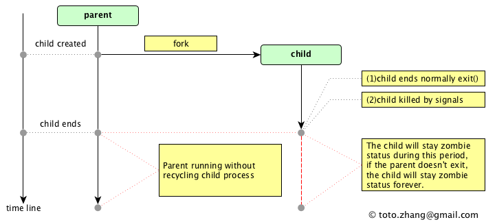
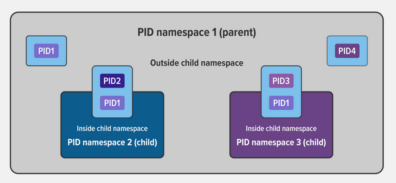

# **Answer Linux Programming**
- [**Answer Linux Programming**](#answer-linux-programming)
  - [**1.wait() in Linux**](#1wait-in-linux)
  - [**2.What is zombie process**](#2what-is-zombie-process)
  - [**3.What is namespaces in Linux**](#3what-is-namespaces-in-linux)

## **1.wait() in Linux**

The wait() system call suspends execution of the calling thread until one of its children terminates.  The call wait(&wstatus) is equivalent to:
           *waitpid(-1, &wstatus, 0);*

The value of options is an OR of zero or more of the following constants:
>       WNOHANG
-      return immediately if no child has exited.
>       WUNTRACED
-       also return if a child has stopped. Status for traced children which have stopped is provided even if this option is not specified.
>       WCONTINUED (since Linux 2.6.10)
-       also return if a stopped child has been resumed.

The *waitpid()* system call suspends execution of the calling thread until a child specified by pid argument has changed state. By default, waitpid() waits only for terminated children, but this behavior is modifiable via the options argument

*pid_t* **waitpid**(pid_t pid, int *_Nullable wstatus, int options);

The value of pid can be:
< -1   meaning wait for any child process whose process group ID is  equal to the absolute value of pid.
-1     meaning wait for any child process.
0      meaning wait for any child process whose process group ID is equal to that of the calling process at the time of the call to waitpid().
\> 0    meaning wait for the child whose process ID is equal to the value of pid.

## **2.What is zombie process**

A zombie process, also known as a defunct process, is a process in the Linux operating system that has completed execution but still has an entry in the process table. In other words, the process has finished executing its code but its parent process has not yet read its exit status.

Zombie processes usually occur when a child process terminates, but the parent process fails to handle its termination cleanly. This can happen if the parent process is busy with other tasks and neglects to call the necessary system function to retrieve the exit status of the child process. As a result, the zombie process remains in the process table until the parent process reaps its exit status.

Zombie processes typically do not consume any system resources, other than a small amount of memory to store their process table entry. However, a large number of zombie processes can accumulate if the parent process continues to neglect reaping the exit status of its terminated children. In extreme cases, this can lead to a depletion of process table entries and cause performance issues.

To resolve the issue of zombie processes, the parent process should properly handle the termination of its child processes by using system calls such as "wait()" or "waitpid()". These system calls allow the parent process to retrieve the exit status of its terminated children and remove their entries from the process table, preventing them from becoming zombies.

**Which process become zombie process? Parent or Children process?**
In a scenario where a process becomes a zombie, it is the child process that becomes a zombie, not the parent process.

When a child process terminates and finishes executing, it enters the zombie state until its parent process collects its exit status. The zombie process retains an entry in the process table, but it does not actively consume any system resources. Instead, it waits for the parent process to call a system function, such as "wait()" or "waitpid()", to collect its exit status.

## **3.What is namespaces in Linux**
Namespaces are a feature of the Linux kernel that partitions kernel resources such that one set of processes sees one set of resources while another set of processes sees a different set of resources.
The key feature of namespaces is that they isolate processes from each other. On a server where you are running many different services, isolating each service and its associated processes from other services means that there is a smaller blast radius for changes, as well as a smaller footprint for security‑related concerns.

***Types of Namespaces***

Within the Linux kernel, there are different types of namespaces. Each namespace has its own unique properties:

- A user namespace has its own set of user IDs and group IDs for assignment to processes. In particular, this means that a process can have root privilege within its user namespace without having it in other user namespaces.
- A process ID (PID) namespace assigns a set of PIDs to processes that are independent from the set of PIDs in other namespaces. The first process created in a new namespace has PID 1 and child processes are assigned subsequent PIDs. If a child process is created with its own PID namespace, it has PID 1 in that namespace as well as its PID in the parent process’ namespace. See below for an example.
- A network namespace has an independent network stack: its own private routing table, set of IP addresses, socket listing, connection tracking table, firewall, and other network‑related resources.
- A mount namespace has an independent list of mount points seen by the processes in the namespace. This means that you can mount and unmount filesystems in a mount namespace without affecting the host filesystem.
- An interprocess communication (IPC) namespace has its own IPC resources, for example POSIX message queues.
- A UNIX Time‑Sharing (UTS) namespace allows a single system to appear to have different host and domain names to different processes.

***An Example of Parent and Child PID Namespaces***
In the diagram below, there are three PID namespaces – a parent namespace and two child namespaces. Within the parent namespace, there are four processes, named PID1 through PID4. These are normal processes which can all see each other and share resources.

The child processes with PID2 and PID3 in the parent namespace also belong to their own PID namespaces in which their PID is 1. From within a child namespace, the PID1 process cannot see anything outside. For example, PID1 in both child namespaces cannot see PID4 in the parent namespace.

This provides isolation between (in this case) processes within different namespaces.

